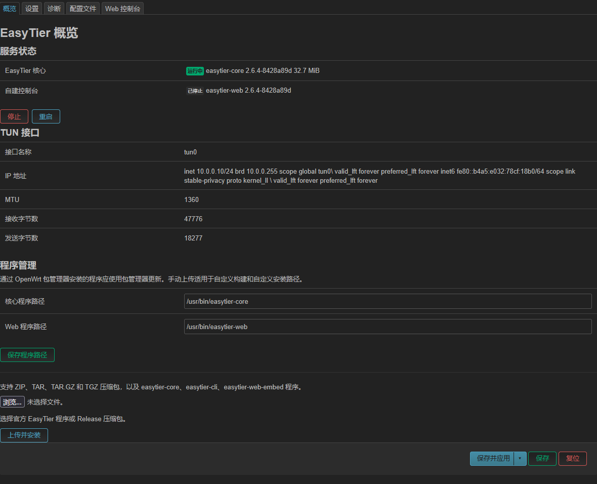
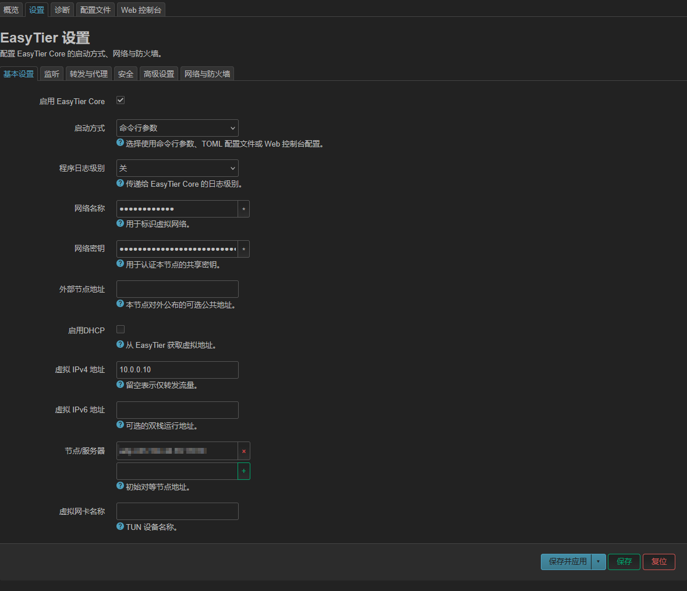
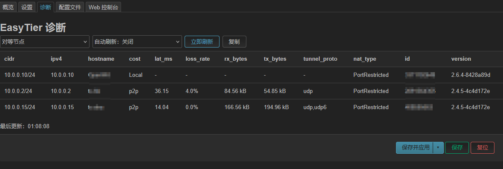
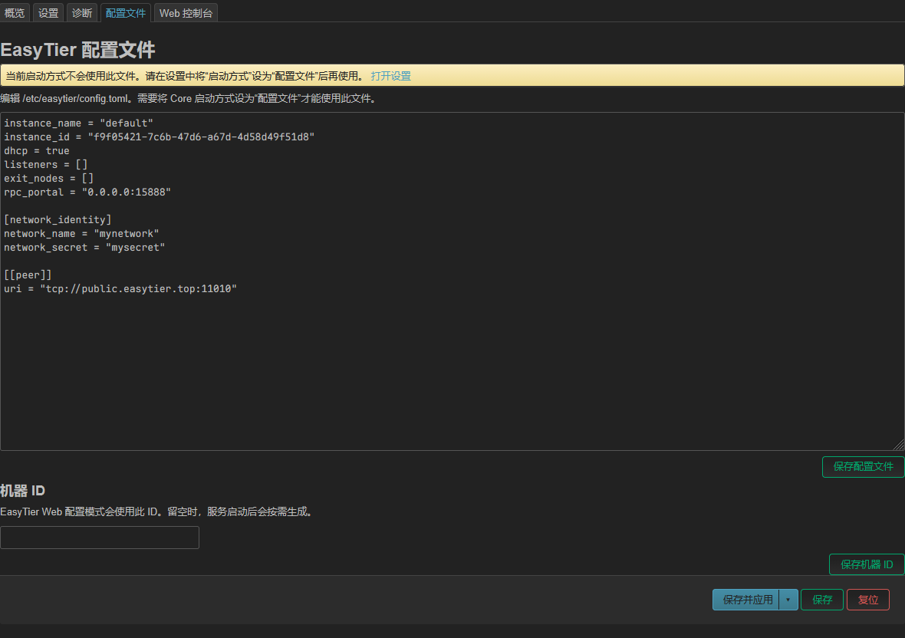
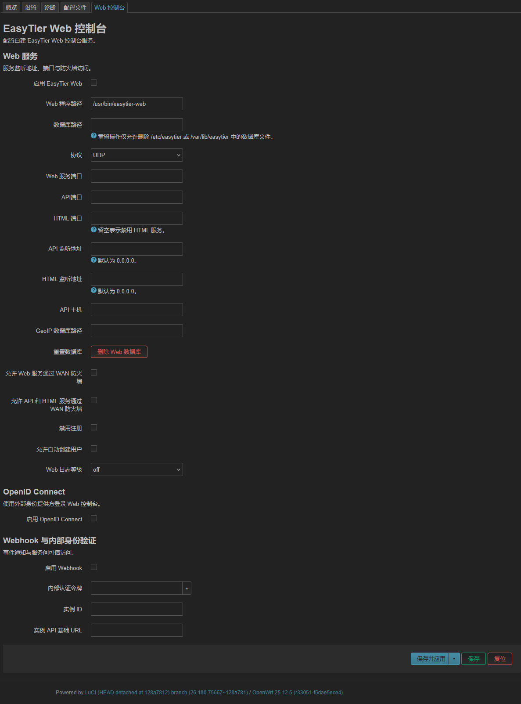

# luci-app-easytier

[English](README_EN.md) | 简体中文

[](LICENSE)
[](https://openwrt.org)

OpenWrt LuCI 插件，用于配置和管理 [EasyTier](https://github.com/EasyTier/EasyTier)。

## 界面预览



<details>
<summary>查看设置、诊断、配置文件和 Web 控制台页面</summary>









</details>

## 与上游项目的区别

本项目基于 [EasyTier 官方 LuCI 项目](https://github.com/EasyTier/luci-app-easytier)，面向 OpenWrt 24.10 及以上版本。EasyTier Core 使用 [官方发布版](https://github.com/EasyTier/EasyTier/releases)，本项目主要维护 OpenWrt 侧的 LuCI 集成、服务管理和软件包构建与分发。

- **LuCI 与平台支持：** 使用 LuCI JavaScript 页面和 rpcd ACL，目标为 OpenWrt 24.10、25.12 及更新版本。上游项目以 LuCI Lua 旧架构为主，并列出 OpenWrt 18.06 至 26.x 的支持范围。
- **构建与分发：** 按目标架构固定 EasyTier 版本并在构建时校验 SHA256；另提供带签名的 IPK/APK 软件源。设备通过包管理器更新核心程序，服务启动时不会联网下载程序。
- **运行维护：** 可选检查配置的 IPv4 目标；全部目标都不可达时重启 EasyTier Core。

UCI 配置、TOML 编辑、节点诊断、程序上传和 Web 控制台管理等使用场景与上游项目有重合；本项目的主要差异在 OpenWrt 集成方式和软件包维护流程。

## 支持范围

- OpenWrt 24.10、25.12 及更新版本，包括 Snapshot。
- EasyTier 提供 Linux 发布包的 OpenWrt 架构：ARM、AArch64、MIPS、MIPSel 和 x86_64。实际可用包以对应设备架构构建结果为准。
- 使用 LuCI JavaScript 前端、rpcd ACL 和 procd 服务管理，不支持旧版 LuCI Lua 页面。

## 安装

从项目 Releases 下载与设备架构和 OpenWrt 版本匹配的安装包。24.10 使用 IPK，25.12 及更新版本使用 APK。核心程序包和 LuCI 插件需要分别安装：

OpenWrt 24.10：

```sh
opkg install /tmp/easytier_*.ipk /tmp/luci-app-easytier_*.ipk
```

OpenWrt 25.12 及更新版本：

```sh
apk add --allow-untrusted /tmp/easytier_*.apk /tmp/luci-app-easytier_*.apk
```

`easytier` 包含 `easytier-core`、`easytier-cli` 和架构支持时的内嵌 Web 控制台。存储空间有限或不需要内嵌 Web 控制台时，使用 `easytier-noweb` 替代；两个核心包不能同时安装。

也可以只安装 `luci-app-easytier`，然后在 **VPN → EasyTier → 概览** 页面的程序管理区安装自定义构建。插件不会在设备启动或服务启动时联网下载程序。

### 从 GitHub Pages 软件源安装

软件源为 OpenWrt 24.10.8 和 25.12.5 的匹配 SDK 构建提供签名包。每个 SDK 版本和架构只保留当前 EasyTier 包；较早版本仍可从 Releases 下载。请使用与设备匹配的 OpenWrt 包架构。24.10 可运行 `opkg print-architecture` 查看架构；25.12 及更新版本可运行 `apk --print-arch`。Snapshot 和其他补丁版本请使用 Releases 中对应的安装包。

OpenWrt 24.10.8：

```sh
. /etc/openwrt_release
FEED_BASE=https://zzwtsy.github.io/luci-app-easytier
ARCH="$DISTRIB_ARCH"
wget -O /tmp/easytier-opkg.pub "$FEED_BASE/keys/easytier-opkg.pub"
opkg-key add /tmp/easytier-opkg.pub
echo "src/gz easytier $FEED_BASE/feeds/24.10.8/$ARCH/packages_ci" >> /etc/opkg/customfeeds.conf
opkg update
opkg install easytier luci-app-easytier luci-i18n-easytier-zh-cn
```

OpenWrt 25.12.5：

```sh
. /etc/openwrt_release
FEED_BASE=https://zzwtsy.github.io/luci-app-easytier
ARCH="$DISTRIB_ARCH"
wget -O /etc/apk/keys/easytier-apk.pem "$FEED_BASE/keys/easytier-apk.pem"
echo "$FEED_BASE/feeds/25.12.5/$ARCH/packages_ci/packages.adb" >> /etc/apk/repositories.d/customfeeds.list
apk update
apk add easytier luci-app-easytier luci-i18n-easytier-zh-cn
```

空间有限或不需要内嵌 Web 控制台时，将 `easytier` 替换为 `easytier-noweb`。两个核心包互相冲突。软件源安装的程序通过对应的包管理器更新；手动上传适用于自定义构建或自定义程序路径。

### 升级与回退

从 GitHub Pages 软件源更新时，只更新 EasyTier 相关包，不要对整个系统执行批量升级。OpenWrt 24.10：

```sh
opkg update
opkg upgrade easytier luci-app-easytier
```

OpenWrt 25.12 及更新版本：

```sh
apk update
apk upgrade easytier luci-app-easytier
```

如果安装的是 `easytier-noweb`，将命令中的 `easytier` 换成 `easytier-noweb`。如果已安装中文翻译包，也可将 `luci-i18n-easytier-zh-cn` 加入更新命令。回退时，从项目 Releases 选择与设备架构和 OpenWrt SDK 匹配的旧版 ZIP，先按 Release 中的 `SHA256SUMS` 校验归档，再解压到 `/tmp/easytier-rollback/`，并确保该目录只包含这次回退的包。24.10 使用：

```sh
mkdir -p /tmp/easytier-rollback
cd /tmp/easytier-rollback
opkg --force-downgrade install ./easytier_*.ipk ./luci-app-easytier_*.ipk
```

25.12 及更新版本使用：

```sh
mkdir -p /tmp/easytier-rollback
cd /tmp/easytier-rollback
apk add --allow-untrusted ./easytier-*.apk ./luci-app-easytier-*.apk
```

使用 `easytier-noweb` 时，将核心包文件改为对应的 `easytier-noweb` 文件。如果回退中文翻译包，也将它的 `.ipk` 或 `.apk` 加到安装命令中。APK 从本地文件回退后会记录该文件的精确版本；要恢复为软件源版本，可更新索引并对这些指定包执行 `apk upgrade --available`。不要省略包名，以免影响其他系统软件。

包回退不会撤销已提交的 `/etc/config/easytier` 或 `/etc/config/firewall` 变更，也不会恢复之前通过 LuCI 上传的自定义程序；需要时请先备份配置并单独上传所需程序。升级后首次加载防火墙配置时，如果 `allow_router_input` 尚未设置，旧 `auto_config_firewall=1` 会迁移为启用，其他旧值迁移为关闭；旧选项缺失时按启用处理，已有新选项会保留。迁移标记会阻止后续启动再次覆盖设置。

更多命令选项见 OpenWrt 的 [opkg 文档](https://openwrt.org/docs/guide-user/additional-software/opkg) 和 [apk 文档](https://openwrt.org/docs/guide-user/additional-software/apk)。

## 功能

- 使用 UCI 表单配置 EasyTier 命令行参数，或编辑 TOML 配置文件。
- 使用 procd 启动、停止和监控 EasyTier Core 与 Web 控制台。
- 可选地按配置的 IPv4 目标检查连通性；全部目标不可达时重启 EasyTier Core。
- 查看服务状态、版本、内存占用、TUN 接口信息、连接信息和系统日志。
- 根据 UCI 配置管理 EasyTier 网络接口、防火墙规则和转发规则。
- 手动上传 EasyTier ELF 程序或 ZIP、TAR、TAR.GZ、TGZ 压缩包。上传大小上限为 100 MiB；安装前会校验归档成员、ELF 文件和 EasyTier 版本信息。
- 配置 Web 控制台、OpenID Connect、Webhook 和数据库路径。

插件配置保存在 `/etc/config/easytier`，TOML 配置保存在 `/etc/easytier/config.toml`。LuCI 菜单位于 **VPN → EasyTier**。

## 从源码构建

将本仓库作为 OpenWrt feed：

```sh
echo "src-link easytier /path/to/luci-app-easytier" >> feeds.conf
./scripts/feeds update easytier
./scripts/feeds install -a -p easytier
make menuconfig
make package/feeds/easytier/easytier/compile V=s
make package/feeds/easytier/luci-app-easytier/compile V=s
```

按需将 `easytier` 替换为 `easytier-noweb`。程序包从 EasyTier GitHub Release 获取固定版本资产，并在构建时校验 SHA256。构建自定义 EasyTier 版本时，需通过 `EASYTIER_VERSION` 指定版本，并通过 `EASYTIER_HASH` 提供该资产的 SHA256。

更多开发约定和验证方式见 [开发指南](DEVELOPMENT.md)。GitHub Actions 构建 OpenWrt 24.10、25.12 和 Snapshot 包。

## 许可证

本项目使用 [Apache License 2.0](LICENSE)。
